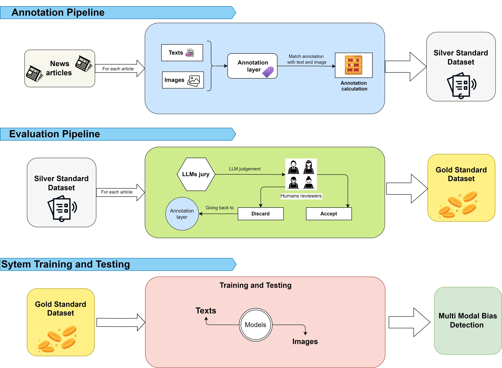

# Annotation Framework

## 1. Annotation Guidelines and Procedure

This framework outlines a structured approach for annotating news articles, incorporating both text and images. The process begins with human annotators labeling a carefully selected subset of the data. Once this subset is annotated, Large Language Models (LLMs) take over to expand these labels across the entire dataset. By aligning annotations with corresponding text and images, the result is a **Silver Standard Dataset**.

## 2. Quality Control

To ensure the reliability and consistency of annotations, multiple quality control mechanisms are in place. **Cohen's Kappa** is employed to measure inter-annotator agreement, highlighting areas that may require further clarification. In addition to automated checks, human reviewers manually evaluate a portion of the annotations. This dual approach maintains the quality and accuracy of the labeled data.

## 3. Evaluation Pipeline

The evaluation process is designed to convert the Silver Standard Dataset into a **Gold Standard Dataset**. Initially, an LLM-based jury provides judgments on the quality of the annotations. These judgments are then reviewed by human experts, who validate, refine, or discard annotations as necessary. This collaborative effort between machines and human reviewers ensures a high-quality final dataset.

## 4. System Training and Testing

Once the Gold Standard Dataset is established, it serves as the foundation for training and testing models in **multi-modal bias detection**. This process ensures the model’s performance remains robust across various data types, including both text and images.
